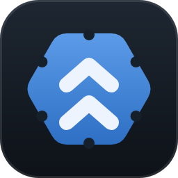
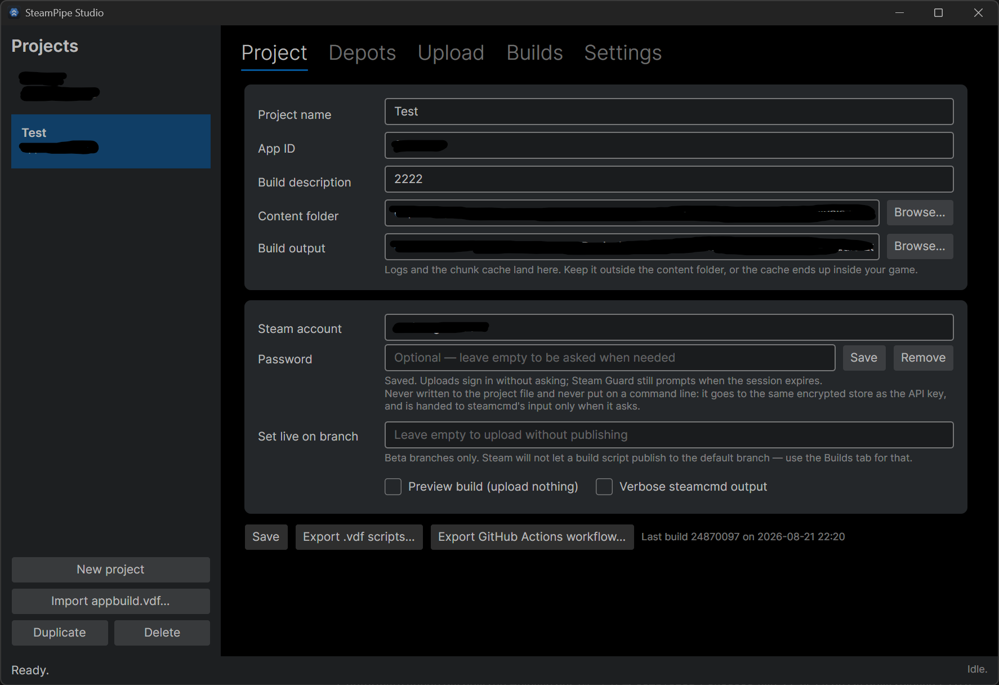

#  SteamPipe Studio

A modern replacement for `SteamPipeGUI.exe`, the build uploader that ships in
`sdk/tools/SteamPipeGUI` of the Steamworks SDK.

The original is a .NET Framework 4.5 WinForms app, x86-only, version 1.4.0.2, last
touched around 2018. It fills in some fields, writes a `.vdf`, shells out to `steamcmd`
and tails the log. SteamPipe Studio does that on .NET 10 and Avalonia — Windows, macOS
and Linux — and adds the half the original never had: knowing what is already live on
Steam.

Not affiliated with or endorsed by Valve.



## What it does

- **Shows you the build before you upload it.** *Preview contents* resolves every file
  mapping against the real filesystem and reports the file count, total size and largest
  files, plus warnings for the two mistakes that cost the most time: a mapping that
  matched nothing, and debug symbols about to ship to customers.
- **Refuses the errors that waste an hour.** Validation runs before `steamcmd` starts:
  build output nested inside the content root (so the chunk cache uploads itself into
  your game), duplicate depot IDs, an empty content folder, an absolute depot path,
  `SetLive` pointing at the default branch — which Steam rejects silently, fifteen
  minutes in.
- **Keeps your password out of the process list and the project file.** `steamcmd` is
  always launched as `+login <account>`, so it reuses the session token it caches itself
  and asks only when that token has expired; the answer is written to its stdin, in
  memory. Saving the password is optional and per account: the Project tab puts it in the
  platform secret store — DPAPI on Windows, the login keychain on macOS, the keyring on
  Linux or an encrypted file where there is none — and it only ever comes back out to be
  written to that same stdin. It is never in the profile JSON and never on a command
  line, where the process list would hand it to every other program on the machine. A
  saved password is offered once per run; if Steam rejects it you are asked, instead of
  the same wrong value looping forever, and Steam Guard still prompts when its session
  expires. The original offered a "save password" checkbox and wrote it in clear text
  into `user.config`.
- **Reads the scripts you already have.** *Import app_build.vdf* parses an existing
  script, follows its depot references and turns it into an editable project. Both SDK
  layouts round-trip: the inline depot of `simple_app_build.vdf` and the multi-file
  `app_build_1000.vdf`.
- **Tells you what is live, and hands it back to you.** The Builds tab reads build
  history and branches through the Steamworks partner Web API and can promote a build to
  a branch, which is the reason you would otherwise keep the Steamworks site open in a
  tab. Every build that is live on a branch also gets a *Download* button: `steamcmd`
  installs it into a folder of your choice — the same files, in the same layout, that a
  player gets, for this machine's platform or any other — so a tester gets last night's
  build without a Steam client and without being handed the account. A build on no
  branch cannot be downloaded, because on Steam a build is a set of depot manifests
  rather than a file: set it live on a private branch first and it becomes one.
- **Shows the whole run as it happens, and lets you take it with you.** The log panel
  follows `steamcmd`'s own console log as well as its pipe, so prompts and progress
  appear when they are printed rather than when the pipe gets around to flushing them —
  on Windows that is the difference between a password dialog and a panel that looks
  hung (see the notes below). A rejected login reports its reason, `Invalid Password`,
  instead of a bare exit code 5. *Copy log*, Ctrl+C or the context menu put the whole
  panel, or just the selected lines, on the clipboard for a bug report.
- **Exports itself to CI.** *Export GitHub Actions workflow* writes a workflow that
  performs the same upload with the paths rewritten for a runner. A tool that can only
  be driven by clicking is a tool a team eventually has to replace.
- **Runs anywhere `steamcmd` does.** The Windows-only limitation of the original was
  never inherent: which builder you run has nothing to do with which platform you ship.

## Requirements

- A copy of the [Steamworks SDK](https://partner.steamgames.com/doc/sdk) — the app needs
  the `sdk/tools/ContentBuilder` folder from it
- A Steam account with upload rights for the app you are publishing
- To run a release: the [.NET 10 runtime](https://dotnet.microsoft.com/download/dotnet/10.0)
- To build from source: the [.NET 10 SDK](https://dotnet.microsoft.com/download/dotnet/10.0)

## Download

Prebuilt archives for every version are on the
[releases page](https://github.com/Andrea332/SteamPipe-Studio/releases):

| Platform | Archive |
| --- | --- |
| Windows x64 | `SteamPipeStudio-<version>-win-x64.zip` |
| macOS, Apple silicon | `SteamPipeStudio-<version>-osx-arm64.tar.gz` |
| macOS, Intel | `SteamPipeStudio-<version>-osx-x64.tar.gz` |
| Linux x64 | `SteamPipeStudio-<version>-linux-x64.tar.gz` |

Unpack the archive and start `SteamPipeStudio` (`SteamPipeStudio.exe` on Windows). The
builds are framework-dependent: 9–12 MB each, and they need the .NET 10 runtime
installed. macOS and Linux get a `tar.gz` rather than a `zip` on purpose — `zip` has
nowhere to record a Unix permission bit, so a binary shipped inside one arrives without
`+x` and will not start.

Whether you downloaded a release or built it yourself, the first thing to do is open
**Settings** and point *Steamworks SDK* at your `sdk/tools/ContentBuilder` folder. When
the path is right, the line underneath reports where it found `steamcmd`.

## Building from source

```bash
git clone https://github.com/Andrea332/SteamPipe-Studio.git
cd SteamPipe-Studio
dotnet restore
dotnet run --project src/SteamPipeStudio.App
```

`global.json` pins the minimum SDK — 10.0.100, rolling forward to anything newer — so a
machine that has the .NET 10 runtime but not the SDK fails with a sentence naming what it
needs, instead of MSB4236 "Microsoft.NET.Sdk could not be found", which names neither.

Building a standalone binary for one platform:

```bash
dotnet publish src/SteamPipeStudio.App -c Release -r win-x64 \
  -p:PublishSingleFile=true --self-contained false
```

`osx-arm64`, `osx-x64` and `linux-x64` work the same way, and from any host: the native
Skia and HarfBuzz libraries for every platform ship inside the Avalonia packages, so a
Windows machine produces the macOS and Linux builds without a Mac or a Linux box being
involved. Use `--self-contained true` for a build that does not need .NET installed, at
the cost of roughly 70 MB.

`build-scripts/build.sh` and `build-scripts/build.bat` publish all four in one go, after
checking that what is installed is the SDK and not just the runtime. Output lands in
`src/SteamPipeStudio.App/bin/Release/net10.0/<rid>/publish`. A tree published on Windows
has no execute bit on the macOS and Linux binaries — NTFS cannot store one — so package
those with `tar`, or `chmod +x` after transferring.

## Tests

```bash
dotnet run --project src/SteamPipeStudio.Tests
```

194 assertions over the whole Core library, exiting non-zero on failure. No test
framework and no packages: the suite runs on a locked-down build agent that cannot
restore from NuGet, which is exactly where you want a build pipeline to still work.

## Layout

```
src/SteamPipeStudio.Core/     no UI dependencies, no NuGet packages at all
├── Vdf/                      KeyValues parser and writer
├── Model/                    profiles, settings, JSON persistence
├── Build/                    script generation, validation, content preflight
├── Steam/                    steamcmd process control, partner Web API
├── Security/                 per-platform secret storage
└── Ci/                       GitHub Actions export

src/SteamPipeStudio.App/      Avalonia 11, MVVM, the only project with packages
src/SteamPipeStudio.Tests/    zero-dependency test harness
build-scripts/                publish all four platforms from any host
.github/workflows/            release.yml — tag, test, publish, draft release
```

`TargetFramework` and `$(AvaloniaVersion)` live in `Directory.Build.props` at the root,
so retargeting or bumping Avalonia is one line rather than three; `global.json` pins the
minimum SDK in the same spirit.

Keeping Core free of UI dependencies is deliberate: the whole build pipeline — parsing,
generating, validating, running `steamcmd` — can be reused from a CLI, a test harness or
a CI task without dragging a desktop framework along.

## Notes on the tricky parts

**The VDF parser does not process escape sequences, on purpose.** Valve's own scripts
contain `"ContentRoot" "..\content\"`. Under standard escaping the trailing `\"` is an
escaped quote and the file will not parse. `steamcmd` reads build scripts with escapes
off, so this matches it. Generated scripts use forward slashes on every platform, which
sidesteps the ambiguity entirely.

**Keys are neither unique nor case-sensitive.** A depot script legitimately holds several
`FileMapping` blocks and several `FileExclusion` values, and the SDK samples mix
`"Recursive"` with `"recursive"` in the same file. Children are an ordered list and
lookup is case-insensitive; a dictionary-backed parser silently discards mappings.

**Exclusion wildcards cross directories; mapping wildcards do not.** `*.pdb` removes
symbols at every depth and `bin/tools*` removes a subtree, but `bin/*` stays at one level
unless `Recursive` is set. They look like the same glob and are not.

**The output is read character by character, not line by line.** `steamcmd` rewrites
progress in place with a bare carriage return and no newline. `ReadLineAsync` appears to
hang for minutes during a large upload and then dumps everything at once — and an
unterminated `Steam Guard code:` prompt is never seen at all, so the process deadlocks
waiting for input nobody knows it wants.

**On Windows the pipe is not even timely, so the console log is read as well.** As soon as
`steamcmd`'s stdout is a pipe rather than a console it is block buffered, and a prompt
sits unflushed in that buffer until something answers it. Measured on one run:
`logs/console_log.txt` next to the executable had "Cached credentials not found." and
"password:" 1.3 seconds in; the pipe delivered the same two lines 23 seconds later, and
only because a reply had been sent blind. So the runner tails the console log for the
duration of the run and feeds it through the same parser, dropping the pipe's late copy
of every line. The same line arriving twice is not always the same shape — the log
flushes each partial write on its own line while the pipe delivers the finished one, so
`.`, `.` and ` 23.1MB (23%)` in the file have to be recognised as `.. 23.1MB (23%)`
from the pipe — which is why the de-duplication in `SteamCmdRunner.cs` is the most
intricate code in the project. If the log cannot be read, twenty seconds of silence
before login is treated as the prompt and the dialog opens anyway; the answer goes to
stdin, which, unlike stdout, works.

**`steamcmd` is run once with `+quit` before every build.** When it finds an update for
itself it installs it and re-executes as a child process, and the build run loses that
child's output stream, prompts included: the log stops at the version banner and both
sides wait for each other until somebody notices. Letting the update happen in a
throwaway process first costs a couple of seconds and removes the case entirely.

**Exit code 0 is not success.** `steamcmd` has returned 0 after a failed depot commit. A
run counts as successful only when the "Successfully finished appID …" line was also
seen. Valve has reworded that line between SDK releases — `appID 480 - build 12345678`
on older builders, `AppID 480 build (BuildID 12345678).` on SDK 1.63 — so the parser
anchors on the first half and reads the build id off the tail; the next rewording
degrades to a success without a number instead of a failure.

**A download is an install of a branch, and the command order is not negotiable.** Steam
has no "download build 12345678": a build is a set of depot manifests, and `steamcmd` can
only install what a branch points at, so the *Download* button runs `+force_install_dir
<folder> +login <account> +app_update <appid> -beta <branch> validate +quit` for a branch
that carries the build. `force_install_dir` has to precede `login` — after it, `steamcmd`
prints a warning and installs under its own folder. A password-protected branch needs
`-betapassword`, which would otherwise sit on the command line for the whole download, so
in that case the `app_update` line moves into a `+runscript` file that is owner-only where
the filesystem can say so and is deleted when the run ends. Downloading a second build
into the same folder is an incremental update — `validate` re-checks what is already
there — and the per-project folder is remembered for that reason. The progress lines have
no percent sign, and `Success! App 'x' fully installed.` is the only line trusted to mean
the files are all there; `Error! App 'x' state is 0x202 after update job.` is translated
into the disk-space problem it almost always is, rather than shown as a hex number.

## Known limits

Two things cannot be verified without a real publisher account, and are the first places
to look if something misbehaves:

- **`Steam/SteamCmdOutputParser.cs`** — Valve does not document `steamcmd`'s output
  format and it changes between SDK releases. Anything unrecognised falls through to the
  log verbatim, so a mismatch degrades to "the progress bar stops moving", not a crash.
  If a successful build stops being detected after an SDK update, this file is the only
  thing that needs changing. The same goes for downloads: `Update state (0x61)
  downloading, progress: 45.17 (…)` drives the bar and `Success! App '480' fully
  installed.` is the only line that counts as done, and both are read off today's
  `steamcmd`.
- **`Steam/PartnerApiClient.cs`** — the JSON shapes of `GetAppBuilds` and `GetAppBetas`
  are not published. Parsing walks the response looking for the fields it needs rather
  than binding to a fixed schema, so a reshaped response degrades to missing columns
  rather than an exception.

Not built yet: per-depot platform gating (`[$WIN32]` conditionals survive an import but
are not editable), drag-and-drop onto the content-root field, diffing a build against the
previous one, and macOS notarisation through the SDK's `ContentPrep.app`.

## Releasing

A release is cut by pushing a tag, and only by pushing a tag:

```bash
git tag v1.2.0
git push origin v1.2.0
```

`.github/workflows/release.yml` runs the test suite, publishes the four runtime
identifiers with the tag's version stamped into the assembly and no `.pdb` files in the
archives, packages them — `zip` for Windows, `tar.gz` with the execute bit set for the
rest — and opens a **draft** release with notes generated from the commits since the
previous tag. A red suite stops the run before a single asset is uploaded; publishing the
draft stays a deliberate human click, after reading the notes.

## Contributing

The project is free and stays free. Use it, change it, ship your own version — the
license below spells out the terms.

If you want your change in the upstream project:

1. **Fork the repository.** Every contribution arrives as a pull request from a fork;
   nobody pushes to this repo directly.
2. **Open an issue first for anything larger than a bug fix.** It is cheaper for both of
   us to disagree about an approach before you have written it.
3. **Keep `dotnet run --project src/SteamPipeStudio.Tests` green,** and add assertions
   for what you changed. If your change touches VDF parsing, file matching or validation,
   a test that fails without your fix is the point of the pull request.
4. **Put logic in Core, not in a view model.** Core has no UI dependencies and that is
   what makes it testable; anything that could be tested headlessly belongs there.
5. **Explain the non-obvious in a comment.** Most of the awkward code in this project
   exists because `steamcmd` or the VDF format is awkward. A comment saying *why*
   survives the next refactor; one restating *what* does not.

Bug reports are welcome and useful. Include the `steamcmd` build log from your build
output folder, and say which SDK version you are on.

## Donations

SteamPipe Studio is free software and will stay that way — there is no paid tier, no
license key and nothing withheld. If it saved you an afternoon and you want to say
thanks, donations are welcome.

<!-- TODO: replace with your donation link once you have picked a platform.
     GitHub Sponsors also needs .github/FUNDING.yml for the Sponsor button to appear. -->

*Donation link coming soon.*

Contributing code, reporting a bug precisely, or improving the documentation helps just
as much, and costs nothing.

## License

GNU General Public License v3.0 — see [LICENSE](LICENSE).

In short: you may use, study, modify and redistribute this program freely. If you
distribute a modified version, you must release its source under the same license, so
that everyone who receives your version keeps the same freedoms. That is a deliberate
choice: improvements to a shipping tool should stay available to the people shipping
with it.

```
Copyright (C) 2026  Andrea Galet

This program is free software: you can redistribute it and/or modify it under the
terms of the GNU General Public License as published by the Free Software
Foundation, either version 3 of the License, or (at your option) any later version.

This program is distributed in the hope that it will be useful, but WITHOUT ANY
WARRANTY; without even the implied warranty of MERCHANTABILITY or FITNESS FOR A
PARTICULAR PURPOSE.  See the GNU General Public License for more details.

You should have received a copy of the GNU General Public License along with this
program.  If not, see <https://www.gnu.org/licenses/>.
```
